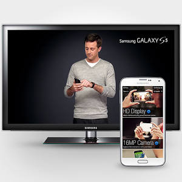

|  Name    |      Google Play  Store Downloads      |
|:----------:|:-------------:|
|  |  |
|  |    |
|  |    |
|  |    |
|  |    |
|  |    |
|  |    |

<table>
    <tr>
        <td>Foo</td>
        <td>Foo</td>
    </tr>
    <tr>
        <td></td>
        <td></td>
    </tr>
</table>

